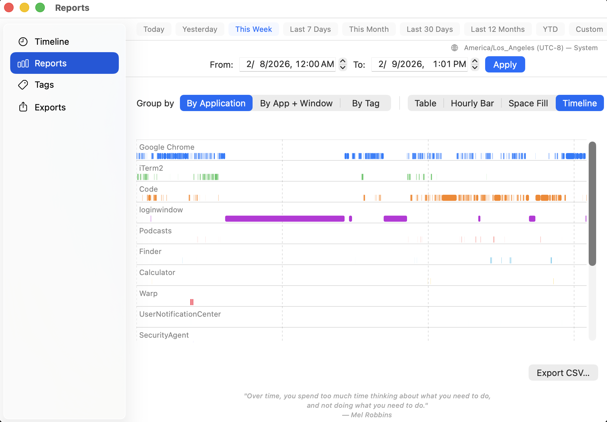
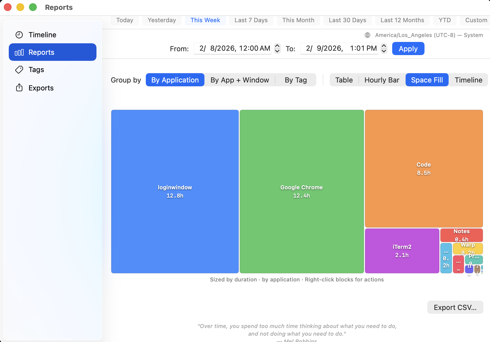
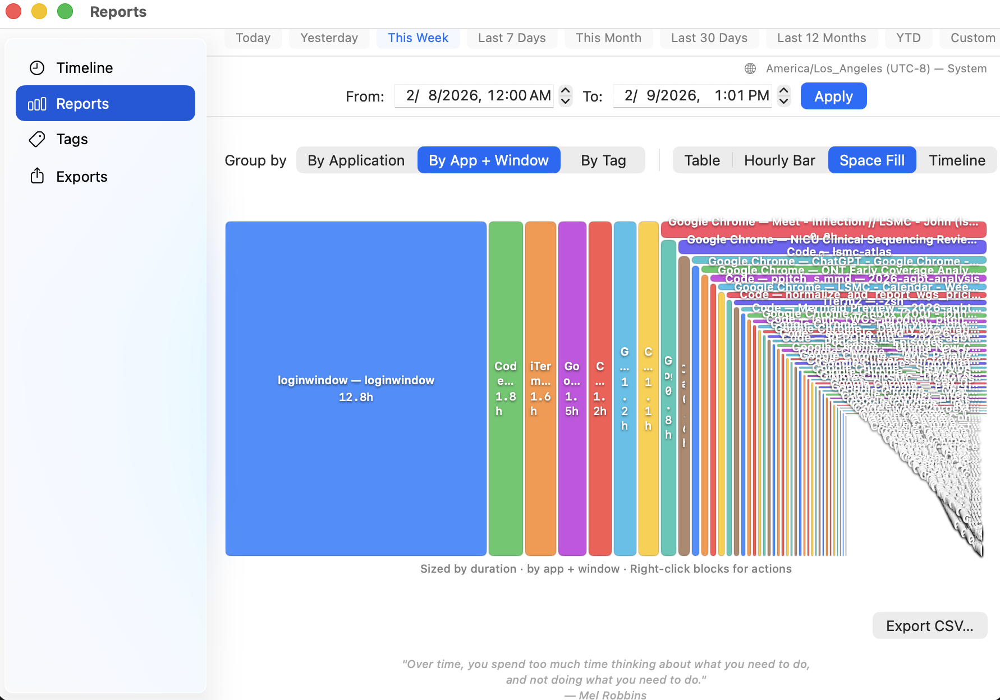
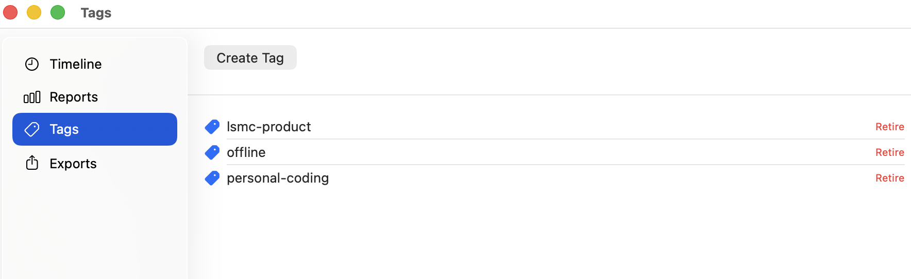
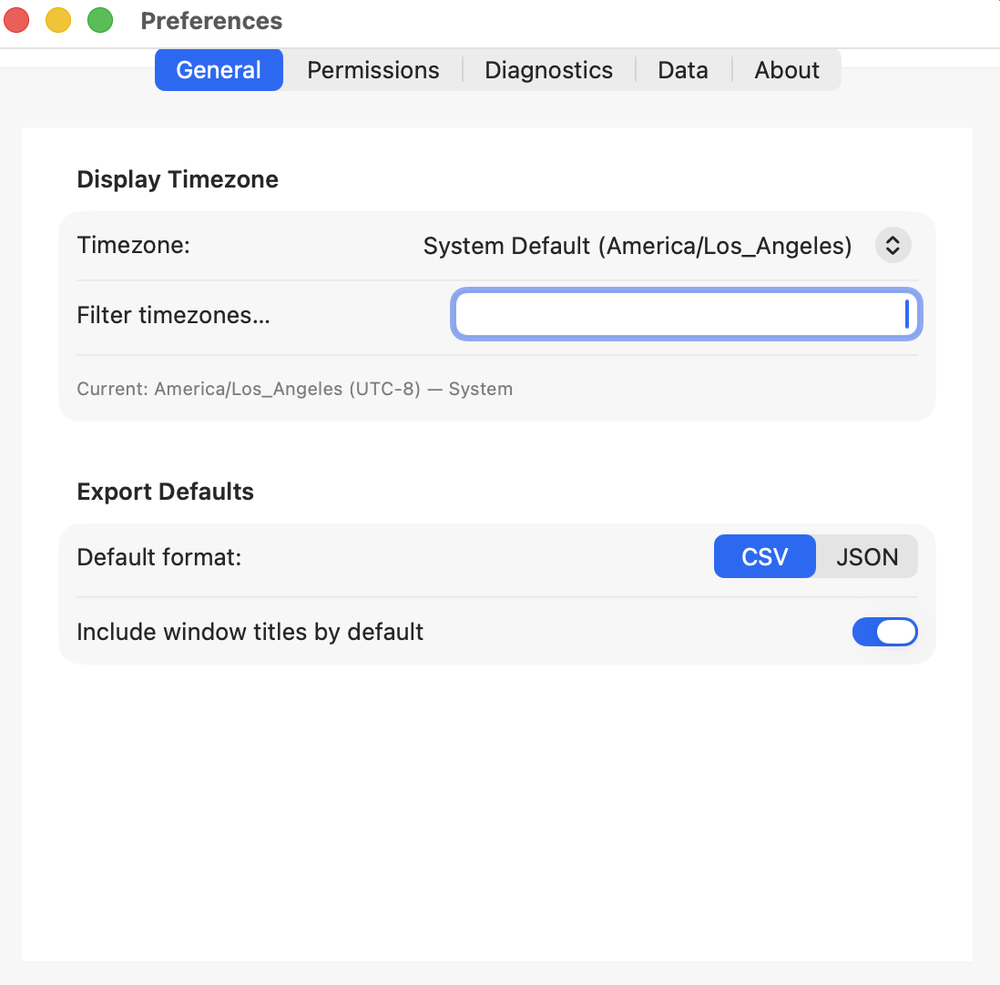
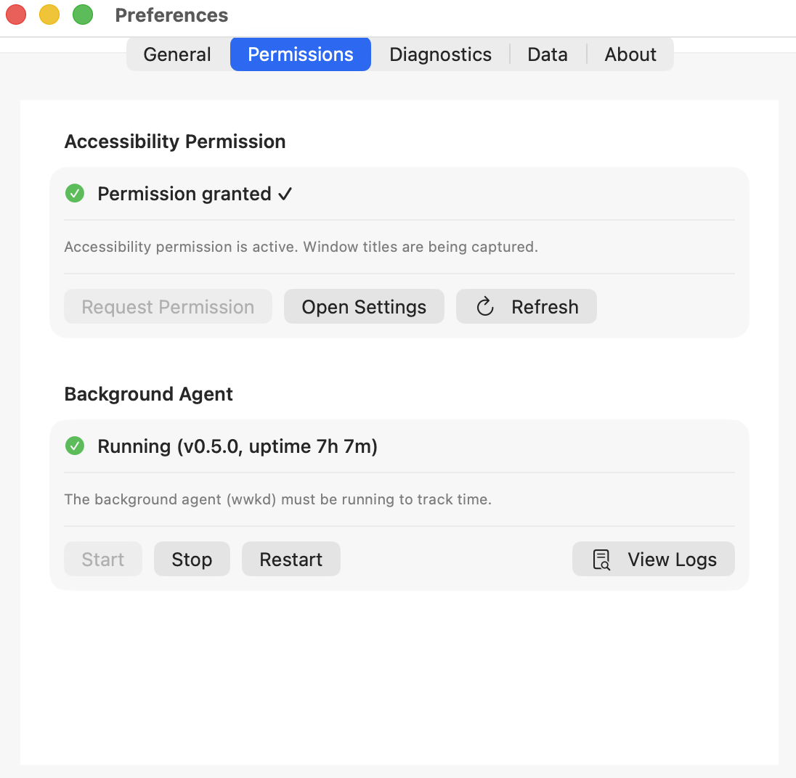
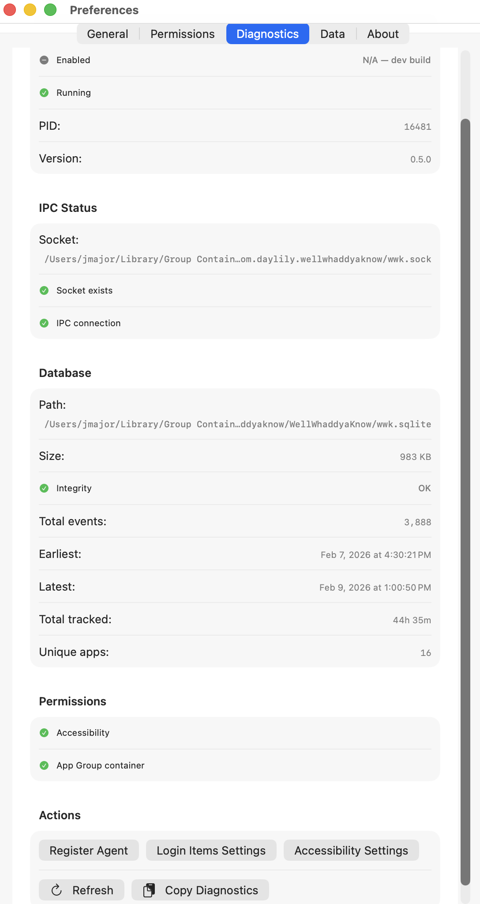
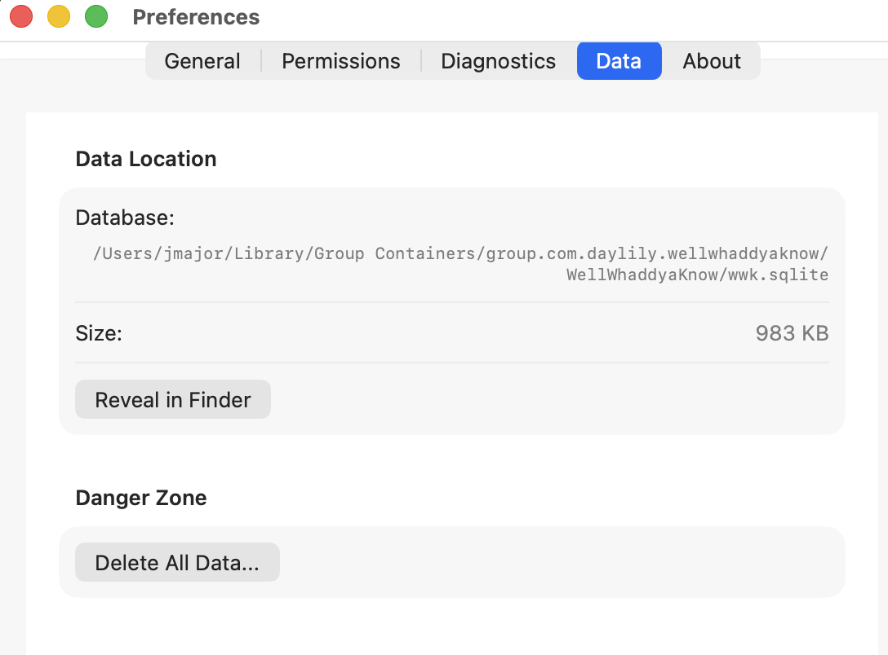
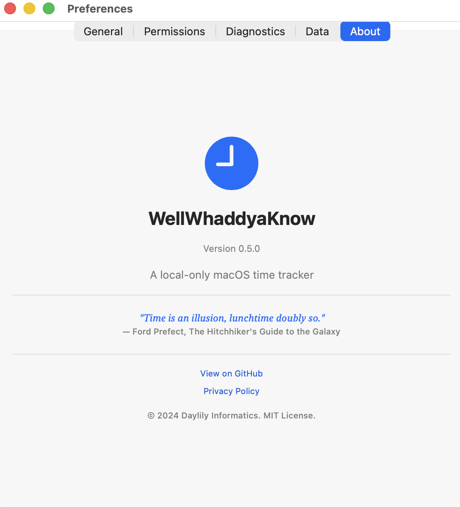

# WellWhaddyaKnow

[](https://github.com/Daylily-Informatics/well-whaddya-know/releases/latest)
[](https://opensource.org/licenses/MIT)
[](https://www.apple.com/macos/)

A **local-only** macOS time tracker that records how time passed on your machine by observing which application and window was frontmost while your screen was unlocked.

**No timers. No idle detection. No cloud. No telemetry.**

> *"Time is an illusion, lunchtime doubly so."*
> — **Ford Prefect**, *The Hitchhiker's Guide to the Galaxy*

## What It Does

- 📊 **Automatic tracking**: Records foreground app and window title when your screen is unlocked
- 🏷️ **Tagging**: Categorize time ranges with custom tags
- ✏️ **Editing**: Delete or add time ranges, undo edits
- 📤 **Export**: CSV and JSON export with date range selection
- 🔒 **Privacy-first**: All data stays on your machine in a local SQLite database

## What It Does NOT Do

- ❌ No keystroke logging
- ❌ No screenshots
- ❌ No mouse tracking
- ❌ No "productivity scoring"
- ❌ No cloud sync
- ❌ No telemetry or analytics

## Components

| Component | Description |
|-----------|-------------|
| **WellWhaddyaKnow.app** | Menu bar app with status popover, viewer/editor, and preferences |
| **wwkd** | Background agent (login item) that writes events to SQLite |
| **wwk** | Command-line interface for reporting and editing |

## Requirements

- macOS 13 (Ventura) or later
- Xcode 14+ (must be downloaded from the App store) **and** Command Line Tools with Swift 6 (build dependency only)
- Accessibility permission (for window title capture — see [Permissions](#permissions))

---

## Installation via Homebrew

The `wwk` Homebrew formula installs **all three components** in a single command: the `wwk` CLI, the `wwkd` background agent, and the `WellWhaddyaKnow.app` menu bar GUI.

### Standard Install (admin user)

Most macOS users have admin (sudo) access. This is the default Homebrew setup.

```bash
# Step 1: Install
brew install Daylily-Informatics/tap/wwk

# Step 2: Register the agent as a login item (starts automatically at login)
wwk agent install

# Step 3: Launch the GUI (menu bar app — look for the icon in your menu bar)
wwk gui
# or equivalently:
open $(brew --prefix)/opt/wwk/WellWhaddyaKnow.app

# Step 4: Grant permissions (see Permissions section below)

# Step 5: Verify
wwk agent status    # confirm agent is running
wwk doctor          # full health check
wwk today           # today's time breakdown
```

### Non-Admin Install (local user, no sudo)

If Homebrew is installed in your home directory (e.g., `~/.homebrew`) or you don't have admin access:

```bash
# Step 1: Install (same command — Homebrew handles local installs)
brew install Daylily-Informatics/tap/wwk

# Step 2: Register the agent
wwk agent install

# Step 3: Launch the GUI
wwk gui

# Step 4: Grant permissions (see Permissions section below)
```

> **Note:** The formula builds from source, so it works regardless of whether Homebrew is in `/opt/homebrew` (default on Apple Silicon), `/usr/local` (default on Intel), or a user-local prefix. The `wwk agent install` command auto-detects the correct binary paths.

### Upgrade

```bash
brew upgrade wwk
wwk agent uninstall   # remove old agent registration
wwk agent install     # re-register with updated binary paths
```

### Uninstall

```bash
wwk agent uninstall   # stop agent and remove login item
brew uninstall wwk
```

### What Gets Installed

| Path | Description |
|------|-------------|
| `$(brew --prefix)/bin/wwk` | CLI binary (symlinked to PATH) |
| `$(brew --prefix)/bin/wwkd` | Agent binary (symlinked to PATH) |
| `$(brew --prefix)/opt/wwk/WellWhaddyaKnow.app` | Menu bar GUI application |
| `.app/Contents/MacOS/wwkd` | Agent copy with proper codesign identity (used by launchd) |
| `~/Library/LaunchAgents/com.daylily.wellwhaddyaknow.agent.plist` | Created by `wwk agent install` |

---

## Permissions

WellWhaddyaKnow requires specific macOS permissions to function. **Without these, tracking will not work or will be incomplete.**

### 1. Accessibility (Required for Window Titles)

The `wwkd` agent needs Accessibility permission to read window titles. Without it, the app still tracks which application is active, but window titles show as "unavailable".

**How to grant:**

1. Open **System Settings** → **Privacy & Security** → **Accessibility**
2. Click the **+** button (you may need to unlock with your password first)
3. Press **⌘+Shift+G** (Go to Folder) and paste:
   ```
   /opt/homebrew/opt/wwk/WellWhaddyaKnow.app
   ```
   On Intel Macs, use `/usr/local/opt/wwk/WellWhaddyaKnow.app` instead.
   For non-standard Homebrew prefixes, run `brew --prefix` to find yours.
4. Select **WellWhaddyaKnow.app** and click **Open**
5. Ensure the toggle next to it is **ON** ✅

> **Important:** Add `WellWhaddyaKnow.app` — **not** the standalone `wwkd` binary. The agent inside the app bundle is codesigned with a stable identifier (`com.daylily.wellwhaddyaknow.agent`) that macOS TCC can track. The standalone `wwkd` at `$(brew --prefix)/bin/wwkd` has a generic linker-signed identity that macOS **silently rejects** when you try to add it to Accessibility.

**Alternatively**, use the GUI:
1. Open the WWK menu bar app → **Preferences…** → **Permissions** tab
2. Click **Request Permission** — this triggers the native macOS prompt

### 2. Background Items (Login Item)

When you run `wwk agent install`, macOS registers `wwkd` as a background login item. macOS may show a notification:

> **"wwkd" wants to run in the background**

Click **Allow** in the notification. If you missed it, enable it manually:

1. Open **System Settings** → **General** → **Login Items & Extensions**
2. Under **Allow in the Background**, find `wwkd` or `com.daylily.wellwhaddyaknow.agent`
3. Ensure the toggle is **ON** ✅

If this is disabled, the agent will not start automatically at login. You can still start it manually with `wwk agent start`, but it won't persist across reboots.

### 3. Verify Permissions

```bash
wwk doctor
```

Expected output when everything is configured correctly:

```
System Health Check
===================

✓ Database: Database exists and passes integrity check
✓ Agent: Agent is running (v0.6.x, uptime Xs)
✓ Accessibility: Accessibility permission granted

All checks passed.
```

### Troubleshooting Permissions

| Symptom | Cause | Fix |
|---------|-------|-----|
| Window titles show "unavailable" | Accessibility not granted | Grant Accessibility to `WellWhaddyaKnow.app` (not `wwkd` directly) |
| Agent not running after reboot | Background item not allowed | Enable in System Settings → Login Items & Extensions |
| `wwk doctor` shows agent not running | Plist not installed or agent crashed | Run `wwk agent install`, check `/tmp/com.daylily.wellwhaddyaknow.agent.stderr.log` |
| Can't add `wwkd` to Accessibility | Binary lacks stable codesign identity | Add `WellWhaddyaKnow.app` instead — the agent inside it has the correct identity |
| Permission granted but not working | Stale TCC cache | Toggle Accessibility OFF then ON, or restart your Mac |

---

## Quick Start

```bash
# Prerequisites: macOS 13+, Homebrew

# Install
brew install Daylily-Informatics/tap/wwk

# Set up agent (starts at login)
wwk agent install

# Launch GUI (menu bar app)
wwk gui

# Grant Accessibility permission:
#   System Settings → Privacy & Security → Accessibility → +
#   Navigate to: /opt/homebrew/opt/wwk/WellWhaddyaKnow.app
#   (see Permissions section above for detailed steps)

# Verify everything works
wwk doctor          # full health check
wwk agent status    # agent process details
wwk today           # today's time breakdown by app
```

## GUI Overview

### Menu Bar

Click the eye icon in the menu bar to see real-time tracking status, current app/window, today's total, and quick actions.



---

### Viewer — Reports

Open the Viewer window to explore your time data. The **Reports** tab offers multiple visualization modes:

**Hourly Bar Chart** — stacked bars showing time per app across each hour of the day:


**Space Fill (by App)** — treemap with proportional blocks sized by total time:



**Space Fill (by App + Window)** — drill down to see time per window within each app:



**Timeline** — Gantt-style view showing exactly when each app was in the foreground:


---

### Viewer — Tags

Create, apply, and manage tags to categorize time ranges. Tags persist across sessions and appear in exports.



---

### Preferences

Configure the app via **Preferences…** in the menu bar dropdown.

| Tab | What it does |
|-----|-------------|
| **General** | Display timezone, polling interval, appearance |
| **Permissions** | Accessibility permission status and setup guide |
| **Diagnostics** | Live agent status, IPC health, database stats, event counts |
| **Data** | Database location, size, backup/reset options |
| **About** | Version info, links, credits |

<details>
<summary><strong>Preferences screenshots</strong> (click to expand)</summary>

**General** — display timezone and tracking preferences:



**Permissions** — accessibility permission status and instructions:



**Diagnostics** — live agent, IPC, and database health:



**Data** — database location and management:



**About** — version and credits:



</details>

---

## CLI Reference

### Commands

```bash
# Reporting
wwk status                                  # current tracking state
wwk today                                   # today's summary (by app)
wwk week                                    # this week's summary
wwk summary --from 2026-01-01 --to 2026-01-31 --group-by app
wwk summary --from 2026-01-01 --to 2026-01-07 --group-by day

# Export
wwk export --from 2026-01-01 --to 2026-01-31 --format csv --out report.csv
wwk export --from 2026-01-01 --to 2026-01-31 --format json --out -

# Tags
wwk tag list
wwk tag create "project-alpha"
wwk tag apply  --from 2026-01-15T09:00:00 --to 2026-01-15T12:00:00 --tag "project-alpha"
wwk tag remove --from 2026-01-15T09:00:00 --to 2026-01-15T12:00:00 --tag "project-alpha"

# Edit timeline
wwk edit delete --from 2026-01-15T12:00:00 --to 2026-01-15T13:00:00 --note "lunch break"
wwk edit undo --id <edit-id>

# Agent management
wwk agent status     # show agent process, launchd, and IPC socket state
wwk agent install    # install launchd plist and start agent
wwk agent start      # start agent (must be installed first)
wwk agent stop       # stop agent
wwk agent uninstall  # stop agent and remove launchd plist

# GUI
wwk gui              # launch the menu bar app

# Diagnostics
wwk doctor           # permissions, agent, db integrity
wwk db info          # schema version, event counts, date ranges
wwk db verify        # PRAGMA integrity_check
```

### Global Options

All commands accept these flags:

| Flag | Description |
|------|-------------|
| `--json` | Machine-readable JSON output |
| `--db <path>` | Override database path (default: app group container) |
| `--timezone <IANA>` | Display timezone, e.g. `America/New_York` (default: GUI preference or system) |

```bash
wwk today --json
wwk summary --from 2026-01-01 --to 2026-01-31 --json --timezone America/Chicago
```

See [docs/cli.md](docs/cli.md) for the full CLI reference.

## Build from Source

Requires **Xcode 14+** (Swift 6.0) and **macOS 13+**.

### GUI app (`.app` bundle)

```bash
git clone https://github.com/Daylily-Informatics/well-whaddya-know.git
cd well-whaddya-know
./scripts/build-app.sh            # debug build
# or
./scripts/build-app.sh --release  # optimized release build
```

The script builds `WellWhaddyaKnow`, `wwkd`, and `wwk`, assembles a signed `.app` bundle, and prints the path:

```
.build/debug/WellWhaddyaKnow.app    # debug
.build/release/WellWhaddyaKnow.app  # release
```

To run:

```bash
open .build/release/WellWhaddyaKnow.app
```

### CLI only

```bash
git clone https://github.com/Daylily-Informatics/well-whaddya-know.git
cd well-whaddya-know
swift build -c release
```

Copy binaries to your PATH:

```bash
# System-wide (requires sudo)
sudo cp .build/release/wwk .build/release/wwkd /usr/local/bin/

# Single-user
mkdir -p ~/.local/bin
cp .build/release/wwk .build/release/wwkd ~/.local/bin/
```

Then install the agent:

```bash
wwk agent install
```

---

## Data Storage

All data is stored locally in:

```
~/Library/Group Containers/group.com.daylily.wellwhaddyaknow/WellWhaddyaKnow/wwk.sqlite
```

The database uses SQLite with WAL mode and immutable append-only event tables. All timestamps are stored as UTC microseconds since Unix epoch. See [docs/datastore.md](docs/datastore.md) for the full schema.

## Architecture

WellWhaddyaKnow uses an **event-sourcing architecture**:

- All state changes are recorded as immutable events in SQLite
- Timeline is computed deterministically from events
- User edits are stored as separate events (raw data is never modified)
- All timestamps stored in UTC; display timezone is presentation-only
- See [docs/architecture.md](docs/architecture.md) for details

## Documentation

- [Architecture Overview](docs/architecture.md)
- [Database Schema](docs/datastore.md)
- [CLI Reference](docs/cli.md)
- [App Store Notes](docs/app-store.md)
- [Privacy Policy](PRIVACY.md)
- [Specification](SPEC.md)

## Development

```bash
# Build (debug)
swift build

# Build (release)
swift build -c release

# Build .app bundle (includes agent, code signing)
./scripts/build-app.sh           # debug
./scripts/build-app.sh --release # release

# Run tests
swift test
```

## License

MIT License. See [LICENSE](LICENSE) for details.

## Privacy

See [PRIVACY.md](PRIVACY.md) for our privacy policy.

**TL;DR**: All data stays on your machine. No cloud. No telemetry. No analytics.
